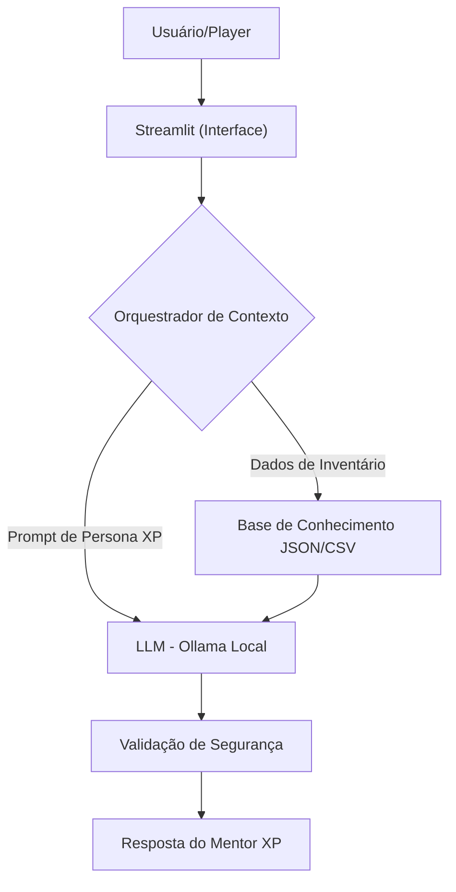

# 🎮 Agente XP: Seu Mentor de Estratégia Financeira

> **Status do Projeto:** 🛠️ Em Desenvolvimento (Fase Beta)  
> **Público-Alvo:** Jovens de 16 a 25 anos (Estudantes e Recém-formados)  
> **Tech Stack:** Python, Streamlit, Ollama (LLM Local)

---

## 📝 Caso de Uso

### O Problema
A grande barreira de entrada no mundo das finanças para jovens é a desconexão entre a teoria chata e a prática do dia a dia. Muitos entendem que devem "guardar dinheiro", mas não compreendem como a inflação, os juros e o custo de oportunidade afetam seu "gold" real (bolsa-estágio, mesada ou primeiro salário).

### A Solução
O **XP** atua como um mentor de RPG. Ele não apenas explica conceitos, mas analisa os dados reais do usuário (gastos com transporte, lazer, assinaturas) e traduz tudo para mecânicas de jogo. Ele foca em **Alfabetização Financeira Pura**, sem nunca realizar recomendações de compra de ativos específicos.

### Público-Alvo
Jovens entre **16 e 25 anos** que buscam autonomia financeira e preferem uma comunicação direta, informal e gamificada.

---

## 👤 Persona e Tom de Voz

* **Nome:** XP (Your Finance Experience Guide)
* **Personalidade:** Mentor "Pro-Player", estratégico, paciente e totalmente livre de julgamentos.
* **Tom de Comunicação:** Informal, "gamer" e altamente didático.
* **Bordões e Estilo:**
    * *Saudação:* "E aí, Player 1! Pronto para otimizar sua build financeira?"
    * *Conceitos:* "A reserva de emergência é o seu **Save Point**. Sem ela, qualquer Boss inesperado te dá Game Over."
    * *Limitação:* "Isso é uma quest de nível alto. Não posso te dar o 'cheat code' de qual ação comprar, mas te ensino a mecânica do risco!"

---

## 🏗️ Arquitetura do Sistema

### Componentes Técnicos
| Componente | Ferramenta |
| :--- | :--- |
| **Interface** | [Streamlit](https://streamlit.io/) |
| **Cérebro (LLM)** | Ollama (Llama 3 / Mistral) |
| **Dataset** | JSON/CSV (Mockados na pasta `/data`) |

---

## 📚 Base de Conhecimento (Data)

O XP utiliza quatro fontes de dados para contextualizar o aprendizado:

1.  **`perfil_investidor.json`**: Status do Player (Nível, Classe, Meta de Gold).
2.  **`transacoes.csv`**: Log de Atividades (Gastos categorizados como `Fast_Travel`, `Social_Loot`, etc).
3.  **`produtos_financeiros.json`**: Catálogo de Itens (Descrições didáticas de Selic, CDB, FIIs).
4.  **`historico_atendimento.csv`**: Quest Log (Histórico de conceitos já aprendidos).

---

## 🛡️ Segurança e Anti-Alucinação

* **[X] Zero Recomendação:** O agente é bloqueado para termos de compra/venda.
* **[X] Grounded Truth:** Respostas baseadas estritamente nos dados fornecidos.
* **[X] Sandbox Educativo:** Se o tema for fora de finanças, o XP redireciona o foco para a "campanha" principal.
* **[X] Privacidade:** Execução local via Ollama, garantindo que os dados do "Player" não saiam da máquina.

---

## 📊 Métricas de Avaliação (Beta Test)

| Métrica | O que avalia | Meta |
| :--- | :--- | :--- |
| **Precisão de Scan** | Extração correta de valores do CSV/JSON. | 100% |
| **Integridade do Shield** | Bloqueio de recomendações de investimento. | 100% |
| **Sintonia da Guilda** | Clareza das analogias de game para o usuário. | Nota > 4/5 |

---

## 🚀 Como Executar (Em breve)

1.  Instale o [Ollama](https://ollama.ai/) e baixe o modelo (ex: `ollama run llama3`).
2.  Clone este repositório.
3.  Instale as dependências: `pip install streamlit pandas ollama`.
4.  Rode o comando: `streamlit run app.py`.

---

**Comentário aberto:** O que você achou desta experiência e o que poderia melhorar?
A experiência de integrar uma LLM local (Ollama) com uma interface rápida (Streamlit) mostrou que é possível criar um assistente personalizado sem depender de APIs pagas ou enviar dados para a nuvem. O maior desafio foi "adestrar" a IA: no início, ela era prolixa, repetitiva e formal demais (o famoso erro de "persona"). Ajustar o System Prompt e filtrar os dados de entrada foi a chave para transformar um "manual de instruções vivo" em um mentor de estratégia que realmente fala a língua do usuário.

## Resultados

Após os testes, registre suas conclusões:

**O que funcionou bem:**
Privacidade e Performance Local: Rodar o llama3 via Ollama garantiu que os dados financeiros não saíssem da máquina, com um tempo de resposta aceitável após o primeiro carregamento.

Interface Sidebar: Isolar os dados de "Status do Player" (Saldo/Meta) na lateral limpou o chat e evitou que a IA precisasse repetir valores em toda frase.

Customização de Persona: A transição do perfil "Ricardo" para "Enzo" mostrou a versatilidade do sistema em mudar o tom de voz apenas alterando um arquivo JSON e o prompt mestre.

Controle de Fluxo: A implementação de gatilhos de encerramento (tchau/valeu) resolveu o problema da IA ficar "forçando" interação infinita.

**O que pode melhorar:**
Latência de Inicialização: O "Cold Start" do modelo ainda é um gargalo; o usuário precisa esperar alguns segundos na primeira interação.

Memória de Curto Prazo: Em conversas muito longas, a IA ainda tende a "esquecer" restrições de estilo (como o limite de 2 parágrafos) se não houver uma limpeza de cache periódica.

Refinamento de Contexto: O agente ainda depende muito de texto. A experiência seria superior com a integração de gráficos dinâmicos (como st.bar_chart) para visualizar o histórico de gastos sem precisar ler resumos textuais.

Tratamento de Alucinações: Eventualmente, a IA inventa termos (como o "Kraaaos") se o prompt de entrada vier com caracteres estranhos ou arquivos mal formatados.
